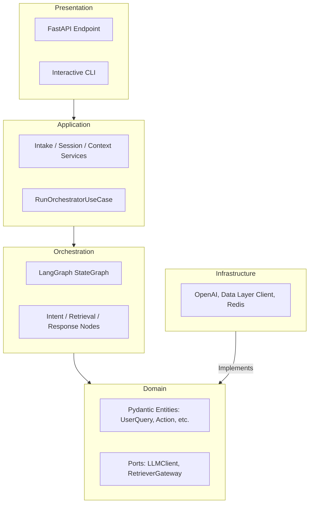

# Architecture Overview: copilot-orchestrator

This document describes the architectural design of the `copilot-orchestrator`, which serves as the "brain" and stateful execution engine for the Copilot system.

## Design Philosophy

The project follows a **Layered Hexagonal Architecture** (Ports & Adapters) to ensure that the complex AI decision logic remains decoupled from specific LLM providers, database technologies, and transport protocols.

### Core Principles
1.  **Agnosticism**: The core logic (Domain/Application) does not know about OpenAI, Redis, or FastAPI. It only sees interfaces.
2.  **Statefulness**: Orchestration is managed via LangGraph, which treats the conversation as a directed graph of state transitions.
3.  **Observability**: Every transition in the graph is traceable and logged for high-fidelity debugging.

## System Layers

## Data Flow

1.  **Ingress**: The `Presentation` layer receives a `UserQuery`.
2.  **Session Management**: The `Application` layer retrieves/creates a session.
3.  **Execution**: The `Use Case` triggers the `LangGraph` runtime.
4.  **Retrieval**: The `RetrievalNode` calls the `Infrastructure` adapter for the Data Layer.
5.  **Inference**: The `ResponseNode` calls the `OpenAI` adapter.
6.  **Persistence**: The state is checkpointed to `Redis` via the Infrastructure layer.
7.  **Egress**: The final `OrchestratorResponse` is streamed back to the user.

## Technology Stack

- **Language**: Python 3.12
- **Orchestration**: LangGraph / LangChain
- **Pydantic**: Data validation and Settings
- **uv**: Dependency and environment management
- **loguru**: Structured JSON logging
- **FastAPI**: Production API delivery
